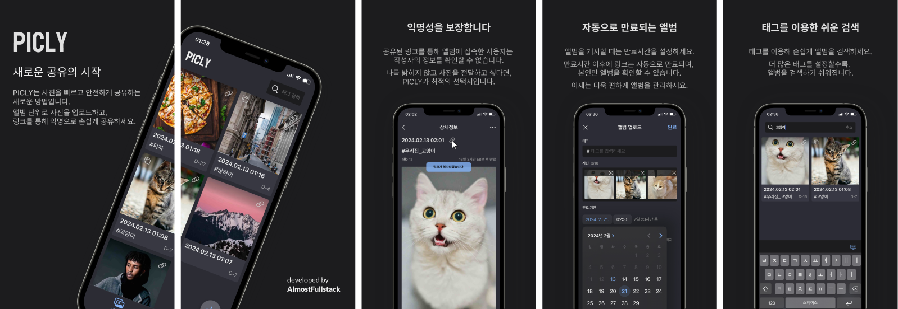

# PICLY - 피클리

### [앱 다운로드 받기](https://apps.apple.com/kr/app/picly-%ED%94%BC%ED%81%B4%EB%A6%AC/id6478313847)

### [웹사이트 바로가기](https://www.picly.app)

PICLY는 익명으로 손쉽게 이미지를 링크로 공유하는 서비스입니다.  
PICLY와 함께 새로운 방식의 공유를 경험하세요.

#### ■ 사진 첨부가 되지 않는 커뮤니티를 이용하고 계신가요?

#### 혹은 댓글에 이미지를 첨부하고 싶지 않으신가요?

PICLY는 사진 업로드가 되지 않는 플랫폼에서 진가를 발휘합니다.  
공유하고 싶은 사진을 골라서 앨범을 생성한 뒤, 링크로 빠르게 공유하세요.  
다른 사용자는 업로더의 정보를 확인할 수 없습니다.

#### ■ 커뮤니티에 게시했던 내 사진, 혹시 다 지우고 계신가요?

PICLY에서 앨범을 게시할 때는 기본으로 만료 시간을 설정합니다.  
만료시간이 지나면 앨범은 비공개로 전환됩니다.  
PICLY로 안심하고 사진을 업로드 하세요.

#### ■ 웹에 게시한 내 사진, 몇 명에게 도달했는지 궁금하지 않으신가요?

PICLY는 업로드한 앨범에 대해 조회수 기능을 제공하고 있습니다.  
내가 올린 재밌는 사진에 대한 반응을 실시간으로 확인하세요.

### [프로젝트 노션 페이지 바로가기](https://jdeoks.notion.site/PICLY-97084d79dfe649918ba5179298f158f9?pvs=4)
